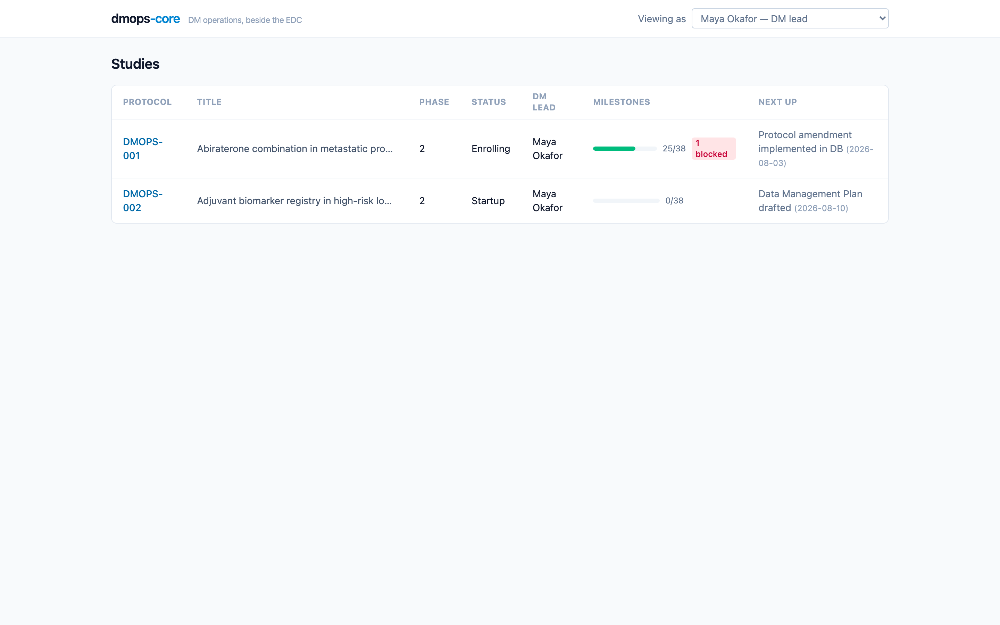

## Prerequisites

Node 22+, pnpm (via corepack), and Docker. Or skip all three and open the
repository in GitHub Codespaces, which boots Postgres, migrates, and seeds
automatically.

## Run it

```bash
corepack enable
pnpm install
cp .env.example .env
pnpm db:up && pnpm db:migrate && pnpm db:seed
pnpm dev
```

Open http://localhost:5175. The API is on http://localhost:8788, with the
OpenAPI reference at `/docs` (see [The API](/dmops-core/guide/api/)).

The `.env` step is not optional: the API refuses to boot without
`DMOPS_AUTH_MODE` set. The example file sets `dev`, which maps the static
tokens below to seeded people. Production uses `oidc`.

## What the seed gives you

Two studies for a fictional sponsor. DMOPS-001 is mid-conduct: startup
milestones complete with honest slips, an amendment in flight, SAE
reconciliation blocked with a visible blocker note, and a CSV fixture source
feeding four computed metrics. DMOPS-002 is in early startup with no source
system, so its adapter metrics report unavailable instead of showing zeros.



Re-seeding is destructive and regenerates every UUID, so treat the demo
database as disposable. `pnpm db:reset` gets you back to this exact state.

Pick a persona from the header dropdown; each maps to a seeded person and
their study assignments:

| Token | Persona | View |
| --- | --- | --- |
| `dev-dmlead-token` | Maya Okafor, DM lead | Full board, can edit |
| `dev-manager-token` | Daniel Reyes, DM manager | Full board, can edit, can re-baseline |
| `dev-analyst-token` | Priya Natarajan, analyst | Full board, writes UAT but not milestones |
| `dev-clinops-token` | Grace Liu, ClinOps | Read-only |
| `dev-sponsor-token` | Sylvia Tran, sponsor | Curated view, no internal notes |
| `dev-qa-token` | Ruth Adler, QA | Whole portfolio, read-only |
| `dev-admin-token` | Alex Admin | Full access |

The split in Priya's row is deliberate: UAT writes are open to analysts
because they run UAT (ADR-0010), while milestone writes stay with DM
leadership. [Personas and access](/dmops-core/personas-and-access/) covers
the full model.

Every write from the board lands in the hash-chained audit trail attributed
to the acting person. Try editing a milestone as Maya, then query
`audit_event` (or call `/health`, which verifies the chain).

## Everyday commands

```bash
pnpm test                  # the suite is also the qualification evidence
pnpm validation:iq         # check installed controls against the live database
pnpm validation:artifacts  # regenerate traceability matrix + OQ report
pnpm metrics:refresh       # compute snapshots (cron-friendly)
pnpm db:reset              # drop, remigrate, reseed
pnpm screenshots --yes     # regenerate the docs screenshots (reseeds first)
```

Next: the [five-minute tour](/dmops-core/tour/) walks the seeded portfolio
end to end, switching personas along the way.
