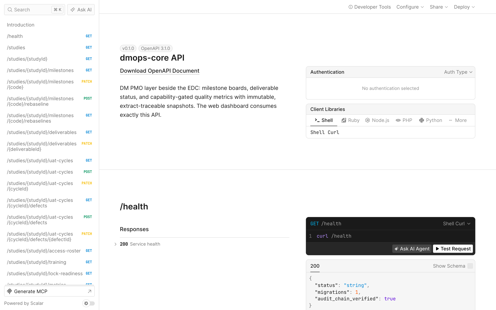

Everything the web board shows comes through one documented REST API, and
the board has no privileged path: what it can read and write, any HTTP
client can. The API describes itself with an OpenAPI 3.1 spec at
`/openapi.json` and an interactive reference at `/docs`.



## Authentication

Every request carries a bearer token. In dev mode
(`DMOPS_AUTH_MODE=dev`) the tokens are the static persona tokens from
[Getting started](/dmops-core/getting-started/); in production the same
header carries an OIDC token. Authorization is assignment-based either way:
what a token can see and change is derived from the person's role on each
study (see [Personas and access](/dmops-core/personas-and-access/)).

```bash
curl -s http://localhost:8788/studies \
  -H "Authorization: Bearer dev-dmlead-token"
```

## The route map

**Studies**

- `GET /studies`: the portfolio, with per-study milestone roll-ups
- `GET /studies/{studyId}`: one study's registry record

**Milestones**

- `GET /studies/{studyId}/milestones`: the full board
- `PATCH /studies/{studyId}/milestones/{code}`: forecast, actual, status,
  blocker note, evidence URI. Deliberately cannot write `planned_date` or
  `baseline_date`.
- `POST /studies/{studyId}/milestones/{code}/rebaseline`: the governance
  action that moves the plan
  ([ADR-0009](/dmops-core/reference/decisions/0009-append-only-rebaseline-governance/))
- `GET /studies/{studyId}/milestones/{code}/rebaselines`: the append-only
  re-baseline history

**Deliverables**

- `GET /studies/{studyId}/deliverables`
- `PATCH /studies/{studyId}/deliverables/{deliverableId}`

**UAT**

- `GET | POST /studies/{studyId}/uat-cycles`
- `PATCH /studies/{studyId}/uat-cycles/{cycleId}`: enforces the completion
  gate
- `GET | POST /studies/{studyId}/uat-cycles/{cycleId}/defects`
- `PATCH /studies/{studyId}/uat-cycles/{cycleId}/defects/{defectId}`

**Metrics**

- `GET /studies/{studyId}/metrics`: latest value per metric, including
  unavailable states with their named gaps
- `GET /studies/{studyId}/metrics/{metricId}/sites`: the by-site
  drill-down
- `GET /studies/{studyId}/metrics/{metricId}/snapshots`: snapshot history
  by grain

**Health**

- `GET /health`: public; reports migration count and verifies the audit
  chain end to end on every call

## Role-aware serialization

Responses are shaped per requester, not per endpoint. A sponsor-only
requester receives the curated serialization: blocker notes, re-baseline
reasons, and defect resolution notes are excluded, while dates, statuses,
and counts pass through. There is no separate sponsor API to drift out of
sync: one endpoint, one set of facts, role-scoped fields (DM-P5).
