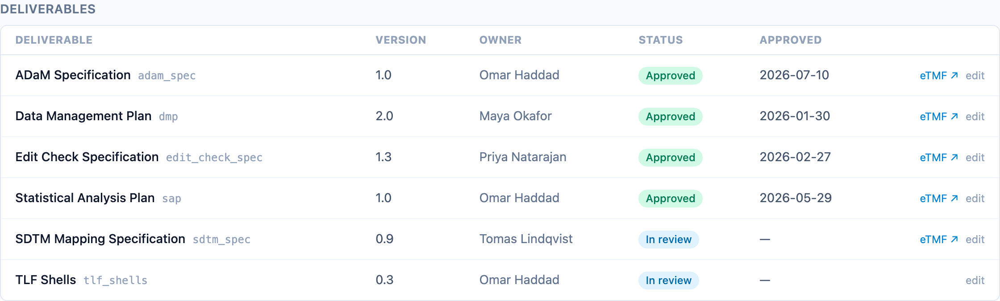

Every study produces a stack of controlled documents — the Data Management
Plan, the edit check specification, the SDTM mapping spec — whose approval
status everyone asks about and whose records live in the eTMF. dmops-core
tracks exactly that split: the status is owned here, the record stays where
it is signed.

## Status and a pointer

A deliverable row is a type, a title, a version, an owner, a status chip
(`draft`, `in_review`, `approved`, `superseded`), an approved date, and an
`etmf_uri` pointing at the record in the system that holds it. Corrections
are new rows or status changes, all audited; nothing is silently
overwritten.

Moving a deliverable to `approved` requires the approval date — the date on
the eTMF record, not the date someone clicked the dropdown. The board
collects it inline before saving.

## Structurally incapable of being the approval record

The `deliverable` table has no signature columns, no file storage, and no
approval ceremony, and never will
([ADR-0006](/dmops-core/reference/decisions/0006-display-only-regulated-records/)).
Holding the e-signature for a spec approval would pull full 21 CFR Part 11
signature scope into this system; displaying status with a link delivers the
same transparency at a fraction of the regulatory surface. Making the table
structurally incapable, rather than policy-incapable, means scope creep
requires a schema change and an ADR, not a quiet feature.

## The API surface

`GET /studies/{studyId}/deliverables` lists them;
`PATCH /studies/{studyId}/deliverables/{deliverableId}` updates status,
version, owner, approved date, or the eTMF link. Writes follow the same rule
as milestones: DM leadership on the study, or admin (see
[Personas and access](/dmops-core/personas-and-access/)).
