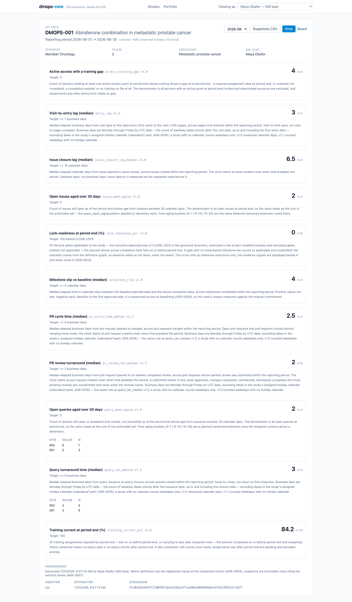

A metric that only lives on a dashboard is a metric that gets retyped into
a slide deck. dmops-core ships its numbers instead: flat CSV exports of the
snapshot history, and a KPI pack — the one-study, one-period artifact a
monthly sponsor or QA meeting actually consumes. Both re-serve stored
facts; neither computes anything
([ADR-0016](/dmops-core/reference/decisions/0016-exports-reserve-stored-facts-and-governed-calendars/)).

## The KPI pack

`GET /studies/:id/kpi-pack?period=2026-06` returns one JSON document: the
study header, every metric in the study's enabled modules with its
**registered** definition text at the version that computed the snapshot
([ADR-0004](/dmops-core/reference/decisions/0004-metrics-are-versioned-code/)),
the period's values at study and site grain, and a provenance block — every
source extract the snapshots cite, with adapter, extraction time, and
checksum. A metric with nothing to report for the period appears with a
named absence, never a zero
([ADR-0005](/dmops-core/reference/decisions/0005-adapter-capability-contract/)).

The web app renders the pack at `/studies/:id/kpi-pack` as a print-friendly
page: pick the period, hit Print, and the browser makes the PDF. There is
no server-side document generator to validate, and no stored pack to drift
from the warehouse — the snapshots are immutable
([ADR-0007](/dmops-core/reference/decisions/0007-append-only-snapshot-warehouse/)),
so regenerating last quarter's pack reproduces it.

Provenance rides in the artifact because the artifact outlives the session
that produced it: a pack filed in an eTMF folder has to answer "which
definition version, computed from which extraction, when" from the file
alone.

## CSV exports

Two flat files, each the corresponding JSON read flattened:

- `GET /studies/:id/snapshots.csv` — the study's full snapshot history,
  every metric, grain, and period, with the cited extract's adapter and
  checksum as columns.
- `GET /portfolio.csv` — the roll-up: one `rollup` row per metric, then
  per-study `study` rows wherever pooling declined. The pooled cells a
  median cannot fill stay empty; the CSV keeps the named absence rather
  than filling it in
  ([ADR-0015](/dmops-core/reference/decisions/0015-portfolio-rollup-derived-from-study-snapshots/)).

There is no separate export query and no separate curation path. The CSV
routes run the same authorization predicates as the JSON they flatten, so a
field a role cannot see in JSON does not exist for that role in CSV —
structurally, not by parallel bookkeeping. Roster mirrors stay out of every
export: they are display-only copies of another system's records, and the
source system exports its own
([ADR-0013](/dmops-core/reference/decisions/0013-training-and-access-mirrors/)).

## Holiday calendars

The pack's header names the study's holiday calendar, and that is the other
half of this slice: the versioned change
[ADR-0004](/dmops-core/reference/decisions/0004-metrics-are-versioned-code/)
promised when the elapsed-time metrics moved to business days.

Calendars are governed files in `calendars/*.yaml` — dated entries, changes
are PRs — consumed at compute time like the milestone taxonomy, not synced
into a table. A study opts in through its `calendar` column; a study with
no calendar counts weekdays only, and a calendar id with no matching file
fails the refresh instead of silently computing weekday-only numbers under
a holiday-aware definition.

The four business-day metrics bumped for it: `query_tat_median` and
`entry_lag` to v1.2, `pr_review_tat_median` and `pr_cycle_time_median` to
v1.1. On the seeded study you can see the bump work: the fictional PMO
calendar puts a two-day break in June 2026, and the June query turnaround
median moves from 4.0 weekday-only business days to 3.0 holiday-aware ones.
The superseded versions stay in the codebase, qualification-tested, so
historical snapshots remain reproducible.

The shipped calendar is fictional on purpose. A real deployment writes its
own file from its own holiday schedule; an example that looked like a real
jurisdiction's calendar would be unverified dates inside qualification
evidence.
