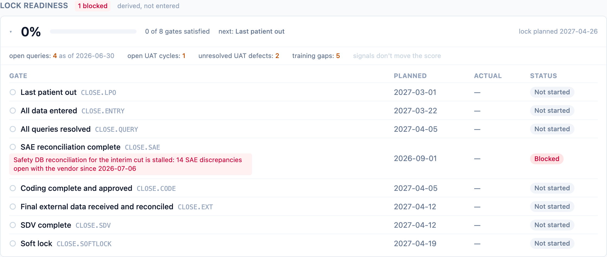

"How close is this study to database lock?" is the question every closeout
governance meeting opens with, and it is usually answered with a slide
assembled by hand from the EDC, the defect log, and memory. dmops-core
already holds every fact that slide needs, so it derives the answer instead
([ADR-0014](/dmops-core/reference/decisions/0014-lock-readiness-derived-from-the-taxonomy/)).

## The checklist comes from the taxonomy

The gate set is not configured anywhere. It is the transitive dependency
closure of `CLOSE.LOCK` in the governed milestone taxonomy
([ADR-0008](/dmops-core/reference/decisions/0008-governed-milestone-taxonomy/)):
today, eight closeout milestones from last patient out through soft lock.
The taxonomy already encodes what lock requires — queries resolved, SAE
reconciliation, coding, external data, SDV — because that dependency graph
is reviewed like code. If the checklist is ever wrong, the fix is a taxonomy
PR, and every study's readiness recomputes.

There is no lock-readiness table and no write path. A readiness score that
could be typed the week before an inspection is worse than no score, and a
stored one would be a second copy of the milestone board waiting to drift
(DM-P1). The only way to move the number is to move the milestones.

## The score is blunt on purpose

Readiness is the unweighted percent of applicable gates whose milestone is
complete; gates marked `na` drop out of the denominator. Weights were
considered and rejected — a weighting scheme is dashboard configuration
wearing a lab coat, and DM-P2 keeps that out of the product. The number is
for the portfolio glance; the per-gate checklist beside it, with planned
dates, blockers, and the next unmet gate in dependency order, is what the
meeting actually works through.

A gate the study never instantiated still appears, unsatisfied. The
checklist comes from the definition graph, so absence of a row reads as
"not done", never "not asked".

## Signals ride beside the score

The panel also shows live evidence the system holds that bears on lock:
open queries as of the latest snapshot (with its as-of date — a snapshot is
not "now"), UAT cycles still open and defects not yet closed, and training
gaps from the [access roster](/dmops-core/guide/training-access/). Signals
never move the score. The score rolls up DM leadership's assertions on the
board; the signals are the system's own evidence displayed beside them,
the same posture the training mirrors take next to `REL.TRAIN`.

When the two disagree outright — `CLOSE.QUERY` asserted complete while the
latest snapshot still shows open queries — the API names the conflict in
`evidence_conflicts` rather than silently adjusting a number. A signal with
no wired source shows as a named absence, not a zero
([ADR-0005](/dmops-core/reference/decisions/0005-adapter-capability-contract/)
fail-closed, applied to display).

## The readiness trend

`lock_readiness_pct` (DM-Q9) snapshots the score monthly into the immutable
warehouse, computed like `milestone_slip` from dmops-core's own facts — no
adapter needed, so it works on every study from day one. "Satisfied as of
period end" means an actual completion date on or before period end, so the
history reproduces what was true then, not what the board says now. The
trend is the burn-up [the portfolio page](/dmops-core/guide/portfolio/)
draws across studies (ADR-0015).

Sponsors see the same checklist with gate blocker notes omitted — the
board's rule (DM-P5). Everything else here is dates and statuses, which is
exactly what a sponsor tracking lock progress is owed.
