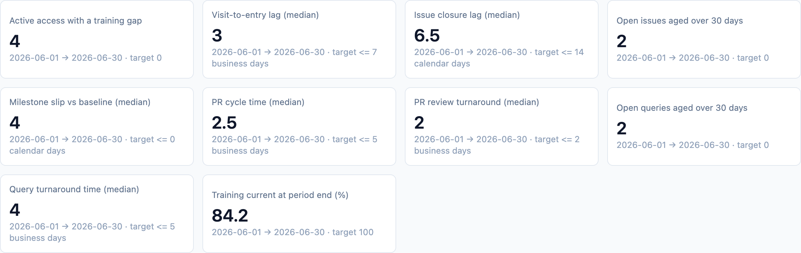

Quality metrics are where status portals usually lose their credibility:
the same KPI computed three ways in three dashboards, argued about in every
governance meeting. dmops-core treats the metric dictionary as the product.
Each metric is one versioned written definition bound to one tested compute
function, and every computed value is an immutable, dated snapshot.

## The dictionary is the product

Every metric is defined once, in a versioned YAML file under `metrics/`, with
the full written definition: clock start and stop, calendar, inclusions,
exclusions, required source fields, and target. The dashboard is a view over
the dictionary, not the other way around. No metric is defined inside a BI
tool ([ADR-0004](/dmops-core/reference/decisions/0004-metrics-are-versioned-code/)).

Each `(id, version)` binds to exactly one pure compute function in
`packages/metrics`. A YAML file without a matching function, or a function
without a file, fails at startup. Changing a file without bumping its version
is a hard registration error: a changed definition is a new version.
[Writing a metric](/dmops-core/guide/writing-a-metric/) walks the full
authoring path.

## Reading the strip

Each card is one metric's latest computed value for the most recent
reporting period, with its target from the dictionary. Clicking a card opens
the detail: the trend across reporting periods, and the by-site drill-down
for metrics computed at site grain.

The strip serves the metrics for the study's enabled modules. All four
shipped metrics belong to the `dm` base module, so today every study shows
the same four cards; when metrics tagged `stat` arrive
([ADR-0012](/dmops-core/reference/decisions/0012-programming-work-frames-and-github-adapter/)),
they will appear only on studies that run the stat module, never as
permanent "unavailable" cards on studies that don't
([ADR-0011](/dmops-core/reference/decisions/0011-stat-programming-as-an-opt-in-module/)).

Metrics declare their grains in the dictionary: `study` and `site` today,
with `country` and `portfolio` grains already in the schema for roll-up work.
A study-grain-only metric says so in the drill-down instead of showing an
empty table.

When a study's source system cannot supply a required field, the card says
so instead of approximating:

That behavior comes from the adapter capability model; see
[Adapters](/dmops-core/guide/adapters/).

## Qualification is the test suite

Every compute function is verified against hand-computed expected values on a
small fixture study (`fixtures/study-DMOPS-001`). The expected values were
computed from the CSVs by hand, not by the code under test, and the tests
carry `DM-Q*` tokens that join them into the generated traceability matrix.
Qualification evidence and CI are the same artifact.

## Snapshots are history, not state

Computed values append to `metric_snapshot`, guarded by database triggers
that reject UPDATE and DELETE for every role. A snapshot records value,
numerator, denominator, record count, grain, period, the metric version that
computed it, and the checksummed extract it came from. Asking what a KPI
looked like at a past lock reproduces the number as reported then
([ADR-0007](/dmops-core/reference/decisions/0007-append-only-snapshot-warehouse/)).
Current state is a view over history.

## The starter dictionary

| Metric | Current | Definition in short |
| --- | --- | --- |
| `query_tat_median` | 1.1 | Median business days, issuance to closure, closed in period |
| `query_open_aging` | 1.0 | Open queries older than 30 days at period end |
| `entry_lag` | 1.1 | Median business days from visit date to first data entry |
| `milestone_slip` | 1.0 | Median days, baseline to actual, completed in period |

The version story has now been exercised once: the two elapsed-time metrics
moved from calendar days (v1.0) to a Monday–Friday business-day clock (v1.1).
The v1.0 compute functions stay in the codebase and stay qualification-tested,
so historical snapshots remain reproducible under the definition that
computed them. Per-country holiday calendars are the next planned versioned
change.
