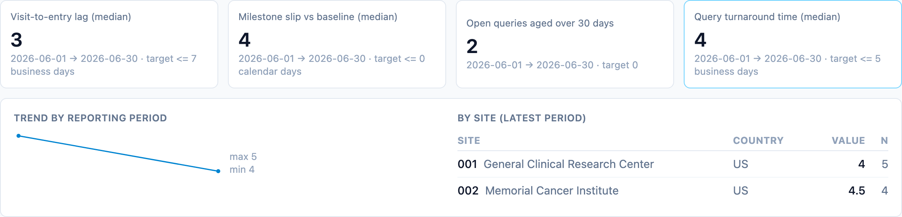
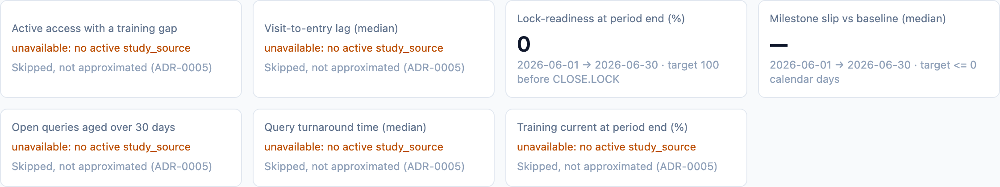

Quality metrics are where status portals usually lose their credibility:
the same KPI computed three ways in three dashboards, argued about in every
governance meeting. dmops-core treats the metric dictionary as the product.
Each metric is one versioned written definition bound to one tested compute
function, and every computed value is an immutable, dated snapshot.

## The dictionary is the product

Every metric is defined once, in a versioned YAML file under `metrics/`, with
the full written definition: clock start and stop, calendar, inclusions,
exclusions, required source fields, and target. The dashboard is a view over
the dictionary, not the other way around. No metric is defined inside a BI
tool ([ADR-0004](/dmops-core/reference/decisions/0004-metrics-are-versioned-code/)).

Each `(id, version)` binds to exactly one pure compute function in
`packages/metrics`. A YAML file without a matching function, or a function
without a file, fails at startup. Changing a file without bumping its version
is a hard registration error: a changed definition is a new version.
[Writing a metric](/dmops-core/guide/writing-a-metric/) walks the full
authoring path.

## Reading the strip

Each card is one metric's latest computed value for the most recent
reporting period, with its target from the dictionary. Clicking a card opens
the detail: the trend across reporting periods, and the by-site drill-down
for metrics computed at site grain.

The strip serves the metrics for the study's enabled modules. The DM suite
belongs to the `dm` base module and shows on every study; the four `stat`
metrics
([ADR-0012](/dmops-core/reference/decisions/0012-programming-work-frames-and-github-adapter/))
appear only on studies that run the stat module, never as permanent
"unavailable" cards on studies that don't
([ADR-0011](/dmops-core/reference/decisions/0011-stat-programming-as-an-opt-in-module/)).

Metrics declare their grains in the dictionary: `study` and `site` today,
with `country` still reserved in the schema. There is no `portfolio` grain
in any definition — the [portfolio page](/dmops-core/guide/portfolio/)
derives its numbers from the stored study-grain snapshots instead
([ADR-0015](/dmops-core/reference/decisions/0015-portfolio-rollup-derived-from-study-snapshots/)).
A study-grain-only metric says so in the drill-down instead of showing an
empty table.

When a study's source system cannot supply a required field, the card says
so instead of approximating:

That behavior comes from the adapter capability model; see
[Adapters](/dmops-core/guide/adapters/).

## Qualification is the test suite

Every compute function is verified against hand-computed expected values on a
small fixture study (`fixtures/study-DMOPS-001`). The expected values were
computed from the CSVs by hand, not by the code under test, and the tests
carry `DM-Q*` tokens (`DS-Q*` for the stat-module dictionary) that join them
into the generated traceability matrix. Qualification evidence and CI are the
same artifact.

## Snapshots are history, not state

Computed values append to `metric_snapshot`, guarded by database triggers
that reject UPDATE and DELETE for every role. A snapshot records value,
numerator, denominator, record count, grain, period, the metric version that
computed it, and the checksummed extract it came from. Asking what a KPI
looked like at a past lock reproduces the number as reported then
([ADR-0007](/dmops-core/reference/decisions/0007-append-only-snapshot-warehouse/)).
Current state is a view over history.

## The starter dictionary

The DM suite, on every study:

| Metric | Current | Definition in short |
| --- | --- | --- |
| `query_tat_median` | 1.2 | Median business days, issuance to closure, closed in period |
| `query_open_aging` | 1.0 | Open queries older than 30 days at period end |
| `entry_lag` | 1.2 | Median business days from visit date to first data entry |
| `milestone_slip` | 1.0 | Median days, baseline to actual, completed in period |
| `lock_readiness_pct` | 1.0 | Percent of lock gates with an actual completion by period end |
| `training_current_pct` | 1.0 | Percent of required training completed and unexpired at period end |
| `access_training_gap` | 2.0 | Persons with active access whose training is missing, overdue, or expired |

The two roster metrics come from the training and access mirrors
([ADR-0013](/dmops-core/reference/decisions/0013-training-and-access-mirrors/)).
Since v2.0, `access_training_gap` computes over the mirror tables themselves
([ADR-0019](/dmops-core/reference/decisions/0019-training-gap-computes-over-the-mirrors/)),
so the grants and the transcript may come from different sources — a split
deployment with access from the EDC and training from an LMS now gets the
monthly snapshot, not just the live roster. See
[Training & access](/dmops-core/guide/training-access/) for the mirror
surface itself.
`lock_readiness_pct` is dmops-native like `milestone_slip` — its source is
the milestone board and the taxonomy's dependency graph, so it computes on
every study with no adapter at all; see
[Lock readiness](/dmops-core/guide/lock-readiness/).

The DS suite, on stat-module studies, computed from the repository frames at
study grain (site and country are EDC concepts with no meaning for
repository work,
[ADR-0012](/dmops-core/reference/decisions/0012-programming-work-frames-and-github-adapter/)):

| Metric | Current | Definition in short |
| --- | --- | --- |
| `pr_review_tat_median` | 1.1 | Median business days, PR opened to earliest submitted review |
| `pr_cycle_time_median` | 1.1 | Median business days, PR opened to merged, merged in period |
| `issue_closure_lag_median` | 1.0 | Median calendar days, issue opened to closed, closed in period |
| `issue_open_aging` | 1.0 | Open issues older than 30 days at period end |

`release_cadence` is named and deferred until a `releases` frame exists.

The version story has now been exercised three times: the elapsed-time DM
metrics moved from calendar days (v1.0) to a Monday–Friday business-day
clock (v1.1), then every business-day clock learned to subtract the study's
governed holiday calendar (`calendars/*.yaml`,
[ADR-0016](/dmops-core/reference/decisions/0016-exports-reserve-stored-facts-and-governed-calendars/)),
and then `access_training_gap` v2.0 changed its sourcing without changing
its math — the first major bump, because where the numbers come from is
part of the definition
([ADR-0019](/dmops-core/reference/decisions/0019-training-gap-computes-over-the-mirrors/)).
Every superseded compute function stays in the codebase and stays
qualification-tested, so historical snapshots remain reproducible under the
definition that computed them. For the calendars themselves — and for
getting these numbers out of the system as CSVs and the monthly KPI pack —
see [Exports and KPI packs](/dmops-core/guide/exports/).
