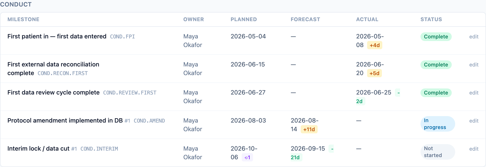

The milestone board is the core surface of dmops-core: five phase-grouped
tables per study, one row per milestone, with dates, slip, status, blockers,
and evidence links. Everything on it derives from two ideas. Milestones come
from one governed taxonomy so studies are comparable, and dates are never
overwritten so slip stays honest.

## One taxonomy, every study

The DM milestone taxonomy lives in `taxonomy/milestone_definitions.yaml`:
stable dotted codes (`SPEC.DMP.APPROVED`, `CLOSE.LOCK`) grouped into five
phases — specification, build, validation and release, conduct, closeout.
Studies instantiate milestones from the taxonomy and may mark any of them
N/A, but cannot invent codes outside it
([ADR-0008](/dmops-core/reference/decisions/0008-governed-milestone-taxonomy/)).
Cross-study roll-up only works when every study speaks the same milestone
language. The full 38-code list is in the
[milestone taxonomy reference](/dmops-core/reference/milestone-taxonomy/).

Taxonomy changes are pull requests against one YAML file, reviewed like code.
The sync loader validates the dependency graph and upserts; retiring a code
sets `active: false`, never deletes.

## Reading the board

Each row shows the milestone label, its monospace taxonomy code, the owner,
and the four-date story told in three columns: **Planned**, **Forecast**
(with a slip badge against plan while in flight), and **Actual** (with a slip
badge against baseline once done). Repeating milestones carry an occurrence
number after the label. A violet `⟲N` counter next to the planned date means
the plan has been re-baselined N times. The eTMF link on the right opens the
evidence record in the system that owns it.

## Planned, forecast, actual — never collapsed

Every study milestone carries four dates. `baseline_date` is the original
commitment and survives re-baselining. `planned_date` is the current plan.
`forecast_date` is what the team currently expects. `actual_date` is what
happened. Slip is computed, not entered: forecast versus planned while in
flight, actual versus baseline once complete.

The API deliberately refuses to write `baseline_date` and `planned_date`
through the milestone PATCH. Moving the plan is a governance action with its
own endpoint
([ADR-0009](/dmops-core/reference/decisions/0009-append-only-rebaseline-governance/)):
a re-baseline appends an immutable record (the new planned date, the previous
one, a required reason, and an optional reference URI such as an eTMF pointer
to the protocol amendment) and updates the current plan in the same audited
transaction. It requires a `dm_manager` assignment on the study or `admin`; a
`dm_lead` moves forecasts but not the plan. Milestones already complete or
N/A cannot be re-baselined. `baseline_date` has no write path at all: the
original commitment survives every re-plan, which is what keeps slip analysis
honest. The board shows how often a milestone has been re-baselined, and the
full history is queryable through the API. Sponsors see the dates but not the
internal reasons.

## Repeating milestones

Protocol amendments and interim locks repeat. The taxonomy stores the bare
code (`COND.AMEND`, `COND.INTERIM`) with a repeating flag; each occurrence is
numbered, so `COND.INTERIM` occurrence 2 is the second data cut.

## Blockers and evidence

A blocked milestone carries a blocker note, visible to internal roles and
excluded from the sponsor serialization (see
[Personas and access](/dmops-core/personas-and-access/)). An evidence link
points at the record in the eTMF; dmops-core stores status plus a URI and
never the document itself
([ADR-0006](/dmops-core/reference/decisions/0006-display-only-regulated-records/)).
