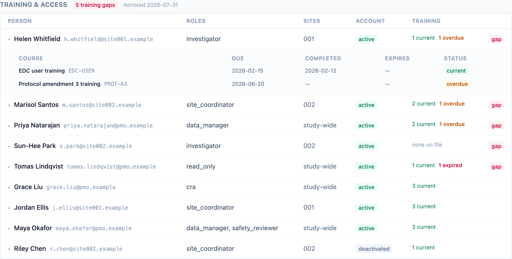

"Does everyone with system access have current training?" is the delegation
question every GCP inspection asks, and it is usually answered by exporting
the EDC user list and the LMS transcript into a spreadsheet and eyeballing
the join. dmops-core reads both facts through the adapter contract and keeps
the join on screen.

## Mirrors, not records

Training records live in the LMS; access grants live in the source system's
user administration. dmops-core mirrors both as normalized frames
(`training_records`, `access_grants`) and persists them in two mirror
tables, replaced wholesale on every refresh and stamped with the checksummed
extract that produced them
([ADR-0013](/dmops-core/reference/decisions/0013-training-and-access-mirrors/)).
The record stays where it is
([ADR-0006](/dmops-core/reference/decisions/0006-display-only-regulated-records/)):
the mirrors hold status and dates, never certificates, and there is no
endpoint that could hand-edit them — the API's database role can only read
the mirror tables. Nobody re-enters a training completion here, per DM-P1.

## Reading the roster

One row per person, with their grants aggregated: roles, site scope
(`study-wide` when the grant has no site), account status as the source
reports it (`active`, `locked`, `deactivated`), and a training summary
derived from the dated facts at read time — a completion with an expiry in
the past is `expired`, an uncompleted assignment past its due date is
`overdue`, an assignment with no due date is required now. Statuses are
never stored; the view derives them, so the roster is always as of today.

The red **gap** badge is the inspection answer: an active account whose
training is missing, overdue, or expired. A deactivated account never flags
— access already gone is not an actionable gap. And a study with no training
feed wired shows no gap badges at all: an unwired LMS is a named gap in the
metrics strip, not evidence that nobody is trained.

The roster serializes identically for every role, sponsors included. A
sponsor auditing its CRO's training compliance is the use case; there are no
internal notes here to curate away.

## The two roster metrics

`training_current_pct` and `access_training_gap` snapshot the same facts
into the immutable warehouse monthly (DM-Q7, DM-Q8), so compliance has a
trend, not just a today. Since v2.0, `access_training_gap` computes over
the mirror tables themselves
([ADR-0019](/dmops-core/reference/decisions/0019-training-gap-computes-over-the-mirrors/)):
each mirror is fed by the first active source that supports its frame, so
in a split deployment — access from the EDC, training from an LMS — the
metric computes from the same rows the roster displays, and metric and
roster answer the same question by construction. A frame no source can
feed is still a named gap, never a silent zero: an EDC-only study reports
`training_records` as having no feeder. Person identity across sources is
the email address by convention; the mirrors deliberately never link to
this system's own person registry.

Which sources can feed the mirrors today: the csv fixture adapter carries
both frames, and the edc-core adapter supplies `access_grants` from its
members listing (an EDC is not an LMS, so it declares `training_records`
unsupported). An LMS adapter is future work on the same contract; see
[Writing an adapter](/dmops-core/guide/writing-an-adapter/).
