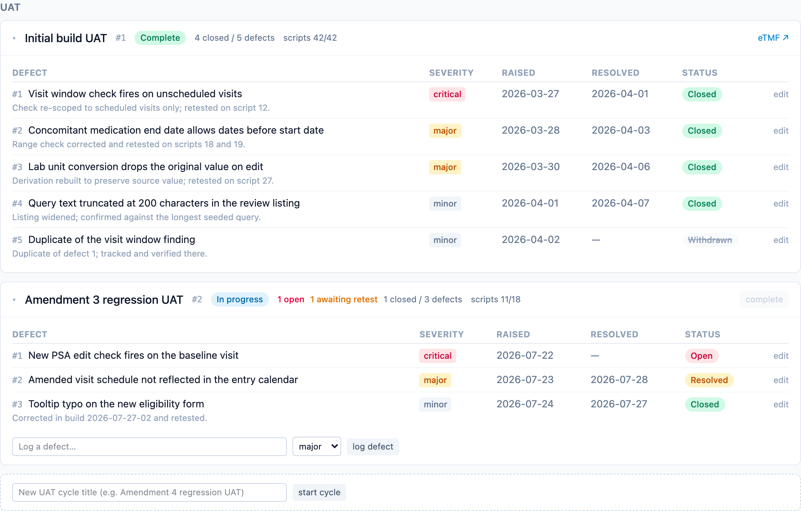

UAT is where a study build earns its go-live, and it is also where status
tracking most often degenerates into spreadsheets. dmops-core tracks UAT as
cycles and defects with a hard completion gate, while the executed test
scripts themselves stay in the validated system that ran them.

## Cycles and defects, not test evidence

UAT is tracked as bounded cycles per study (initial build, post-amendment
regression), each carrying status, dates, mirrored script counts, and an
evidence link to the executed package in the eTMF. Defects belong to a
cycle: severity, a generic lifecycle (`open`, `resolved`, `closed`,
`withdrawn`), a required raised date, and dated endings. `resolved` means
the fix is applied and awaiting retest; `closed` means verified; closing or
withdrawing a defect requires a substantive resolution note.

There are no per-script execution rows. Script execution happens in the
validated system and its record lives in the eTMF; dmops-core stores counts
plus a pointer
([ADR-0010](/dmops-core/reference/decisions/0010-uat-cycles-and-defects-not-test-evidence/),
same stance as deliverables under
[ADR-0006](/dmops-core/reference/decisions/0006-display-only-regulated-records/)).

## The completion gate

The milestone taxonomy names `UAT.COMPLETE` "UAT complete, defects
resolved", and the API enforces the label: a cycle cannot be marked
complete while any of its defects are open or awaiting retest. In the
screenshot above, the second cycle's complete button is disabled for exactly
this reason. The milestone itself is never auto-written: the cycle view
derives the defect counts, and the milestone owner asserts completion with
an evidence link.

## Who writes

UAT writes are open to analysts assigned to the study, alongside DM
leadership and admin. This is the first write predicate wider than
milestone writes, because analysts are the taxonomy's default owners for
the UAT milestones and data entry belongs where the work happens (DM-P6). In the
demo, switch to Priya Natarajan to log a defect. Sponsors see cycles,
counts, severities, and dates; defect resolution notes stay internal
(DM-P5).
