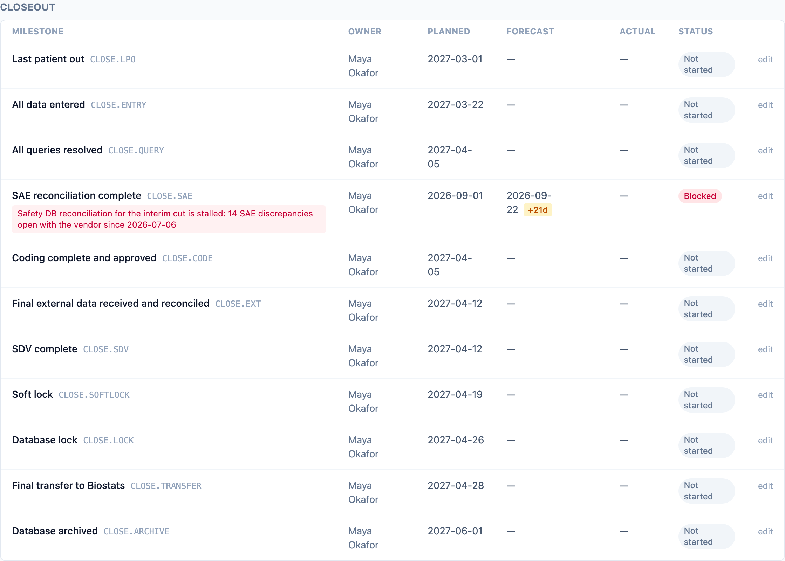
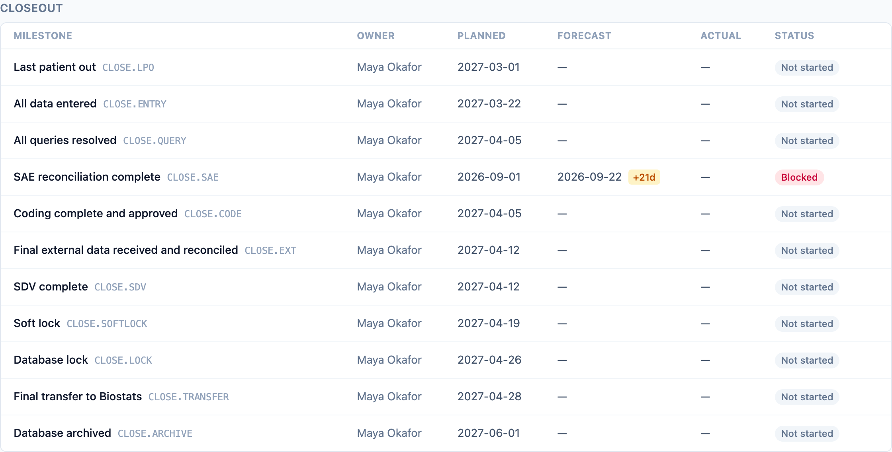

Access in dmops-core is derived from study assignments, not from a global
role picker: a person holds a role (or several) on specific studies, and
every read and write is scoped by those assignments. QA and admin see the
whole portfolio; everyone else sees the studies they are assigned to. There
is one set of facts underneath: role scoping changes which rows and fields
you see, never the numbers themselves (DM-P5).

## What each role can do

| Capability | Who has it |
| --- | --- |
| Read the whole portfolio | `qa`, `admin` |
| Read an assigned study | any active assignment on that study |
| Write DM-phase milestones (forecast, actual, status, blockers) | `dm_lead`, `dm_manager` on the study; `admin` |
| Write analysis-phase milestones (stat-module studies) | milestone writers plus `programmer` or `biostat` on the study |
| Write deliverable status | same rule as milestones; analysis types (`sap`, `adam_spec`, `tlf_shells`) follow the analysis-phase rule |
| Write UAT cycles and defects | milestone writers plus `analyst` on the study |
| Re-baseline a plan | `dm_manager` on the study; `admin` (deliberately stricter than milestone writes) |
| Read the training-and-access roster | any active assignment; nobody can write it — the mirrors are pipeline-fed ([ADR-0013](/dmops-core/reference/decisions/0013-training-and-access-mirrors/)) |
| Curated sponsor serialization | a person whose only role on the study is `sponsor_user` |

Three asymmetries are deliberate. UAT writes are wider than milestone
writes because analysts run UAT and data entry belongs where the work
happens
([ADR-0010](/dmops-core/reference/decisions/0010-uat-cycles-and-defects-not-test-evidence/)).
Analysis-phase writes are wider for the same reason: programmers and
biostatisticians own the STAT milestones, so they record their own status
on studies that run the stat module, while DM-phase milestones stay a
leadership assertion
([ADR-0011](/dmops-core/reference/decisions/0011-stat-programming-as-an-opt-in-module/)).
Re-baselining is narrower because moving the plan is governance, not an
edit: a `dm_lead` moves forecasts, but only a `dm_manager` or admin moves
the plan
([ADR-0009](/dmops-core/reference/decisions/0009-append-only-rebaseline-governance/)).

## The curated sponsor view

A sponsor-only requester gets the same endpoints and the same numbers with
internal working notes excluded: blocker notes, re-baseline reasons, and
defect resolution notes. This is a serialization rule enforced in the API,
so the web board and any other client get it for free. The
training-and-access roster serializes identically for every role, sponsors
included: it holds status and dates only, and a sponsor auditing its CRO's
training compliance is the use case, not a leak
([ADR-0013](/dmops-core/reference/decisions/0013-training-and-access-mirrors/)).

Here is the same Closeout section of DMOPS-001's board, first as Maya
Okafor (DM lead):

and as Sylvia Tran (sponsor):

The sponsor still sees that SAE reconciliation is blocked and three weeks
behind. Hiding status from the sponsor is not the goal; what stays internal
is the working narrative.

## Dev tokens and production

In the demo, personas are static bearer tokens mapped to seeded people
(`DMOPS_AUTH_MODE=dev`); the header dropdown just swaps the token.
Production replaces the token source with OIDC against a real identity
provider; the assignment-scoping logic underneath is identical. Dev mode
is a demo convenience, not an access-control posture, and it appears on the
[honest gaps list](/dmops-core/compliance/#honest-gaps-current-phase).
